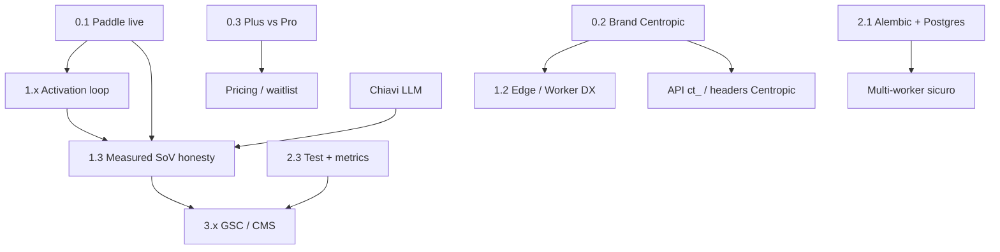

# Centropic — Roadmap tecnica perfezionamento

> **Prodotto:** Centropic (`centropic.ai`) — DaaS B2B per **AI-Driven Visibility (AIO)** e **Generative Engine Optimization (GEO)**  
> **Owner:** Engineering Factory · `info@centropic.ai`  
> **Aggiornata:** 2026-08-05
> **Obiettivo:** chiudere i gap tecnici e di prodotto fino a un servizio self-serve affidabile, monetizzabile e scalabile.

GEO ≠ GIS · AIO ≠ All-in-One · ex-brand GeoPulse solo come continuità SEO (`alternateName`).

---

## Principio guida

Un servizio “perfetto” per Centropic non è feature-bloat: è un loop chiuso e onesto:

```text
Acquisisci URL → Diagnosi affidabile → Score + findings chiari
→ Artifact applicabili → Verifica post-publish → Misura citazioni
→ Alert / rescan → Upgrade self-serve
```

Ogni fase sotto ha **deliverable concreti** e **criteri di done**. Nessuna stima in giorni.

---

## Stato attuale (sintesi)

| Area | Stato |
|------|--------|
| Diagnosi AIO/GEO + pack ZIP + Edge Signals | Operativo |
| Free / Plus (alias `pro`) / Business + entitlements | Operativo; alert gated Plus/Business |
| Async jobs, rescan, history, API key | Operativo; API `ct_` + `gp_` legacy |
| Measured SoV (OpenAI / Perplexity / Claude) | Codice pronto; dipende da chiavi + Plus |
| Paddle Checkout / webhook (Plus + top-up) | Operativo quando `PADDLE_*` configurato |
| AI Overview / Copilot | UI “In arrivo” / pending |
| GSC OAuth | Scaffold |
| Postgres / Alembic / test E2E | Alembic source of truth prod; Postgres/E2E restano |
| Brand Centropic in UI | Header/API Centropic; alias GeoPulse solo compat |
| Security (SSRF pin, CSRF, rate limit, headers) | Avanzata rispetto al polish prodotto |

---

## Matrice capacità (oggi)

| Capability | Free | Plus | Business | Note |
|------------|:----:|:----:|:--------:|------|
| Diagnosi + score + findings | ✓ | ✓ | ✓ | Crawl Free limitato |
| Pack ZIP / email pack | ✓* | ✓* | ✓* | Richiede mail config |
| Edge llms + signals | base | full | full | robots/JSON-LD live da Plus |
| Competitors / measured SoV / prompt bank | | ✓ | ✓ | Chiavi LLM |
| Alert email + webhook | | ✓ | ✓ | Capability `alerts_webhook` |
| Rescan schedulato / storico esteso | | ✓ | ✓ | |
| API / white-label | | | ✓ | Toolkit agenzia |
| Paddle self-serve | | ✓ | ✓ | MoR; webhook + top-up |
| AI Overview / Copilot | | pending | pending | |
| GSC overlay | | scaffold | scaffold | |
| CMS / GitHub apply pack | | — | — | |

\*Email pack soggetto a `PACK_EMAIL_DAILY_LIMIT` e provider SMTP/Resend.

Source of truth: `services/entitlements.py`.

---

## Fase 0 — Fondamenta di verità (P0)

**Perché prima:** senza monetizzazione e brand coerente il resto non è un “servizio”, è un prototipo.

### 0.1 Monetizzazione Paddle
- [x] Integrazione codice Paddle Billing (overlay + webhook + top-up)
- [x] Stripe rimosso — solo Paddle come merchant of record
- [x] Account Paddle live su `centropic.ai` (`PADDLE_ENV=production`, Plus price + top-up su `/prezzi`)
- [x] Env produzione: `PADDLE_*` + `PADDLE_PRICE_PLUS_MONTHLY` + `PADDLE_PRICE_BUSINESS_MONTHLY` + `PADDLE_PRICE_TOPUP_*`
- [x] Notification destination: `https://centropic.ai/billing/paddle-webhook` (fail-closed senza firma → 400)
- [x] CTA Checkout su `/prezzi` quando `paddle_plus_enabled()` / `paddle_business_enabled()` (altrimenti waitlist `/interesse-plus`)
- [x] Smoke test go-live: Free → paga Plus → token mensili + capability Plus senza admin (2026-08-11, webhook firmato su prod)

**Done quando:** un utente Free completa il pagamento Paddle e vede subito le capability Plus senza intervento admin.

### 0.2 Brand / ops Centropic end-to-end
- [x] `README.md` + `DEPLOY.md` → Centropic / `centropic.ai` (GeoPulse solo note legacy)
- [x] Default mail/admin `.env.example` → `@centropic.ai`
- [x] Worker dual-name: `workers/centropic-signals/` (docs) + `workers/geopulse-signals/` (deploy legacy, path `/centropic/signals.json` + alias `/geopulse/…`)
- [x] Header edge: preferire `X-Centropic-*`, mantenere alias `X-GeoPulse-*` per compat
- [x] Header webhook: `X-Centropic-*` + alias `X-GeoPulse-*`
- [x] Prefisso API key: generare `ct_`, accettare `ct_` + legacy `gp_`
- [x] Policy redirect `geopulse.it` → `centropic.ai` in `deploy/nginx.prod.conf` + `DEPLOY.md`

**Done quando:** un nuovo integratore non incontra “GeoPulse” fuori da continuità SEO esplicita.

### 0.3 Chiarezza piano Pro vs Plus
- [x] Decisione: **Free / Plus / Business** — Plus = piano self-serve startup; Business = SKU agenzia (API + white-label). Nessun SKU “Pro” in UX (alias interno `pro` solo legacy DB/entitlements).
- [x] Waitlist canonica `/interesse-plus` (alias 301 `/interesse-pro`)
- [x] Copy pricing / waitlist / flash allineati a Plus · Business

**Done quando:** pricing, waitlist e codice usano lo stesso vocabolario.

---

## Fase 1 — Loop prodotto impeccabile (P1)

**Perché:** il valore percepito è diagnosi → azione → verifica → misura.

### 1.1 Onboarding e activation
- [ ] Checklist post-register (sito in analisi → apri dashboard → scarica pack → abilita Edge)
- [x] Empty states dashboard con un solo CTA chiaro per pending e prima analisi
- [x] Shell onboarding/report/analyze estratta in partial dedicata
- [ ] Messaggi errore crawl già tassonomizzati: collegarli a “cosa fare adesso” in UI
- [ ] Reminder email (opzionale) se analisi ready e utente non torna &lt;24h

**Done quando:** un utente Free arriva da zero a pack scaricato senza supporto.

### 1.2 Artifact applicabili
- [ ] Pack ZIP: README operativo per IT (dove pubblicare ogni file)
- [ ] Edge: wizard “copia snippet” (CF Worker / Vercel) con origin Centropic
- [x] Verify loop: delta SoV verde/rosso e check pass/fail evidenti
- [ ] Safe Apply Plus: espandere allowlist ottimizzazioni sicure (già abbozzato) con audit log

**Done quando:** il cliente applica almeno un artifact e lo verifica in-product.

### 1.3 Measured SoV onesto e sostenibile
- [ ] Completare o **nascondere** engine “In arrivo” (AI Overview / Copilot) — niente badge vuoti
- [ ] Budget probe per utente/giorno + cache prompt/risposta
- [x] Strip operativa SoV: evidenza Stimato/Misurato, saldo token, connector/piani
- [ ] Documentare in metodologia cosa è Misurato vs Stimato (già parziale)

**Done quando:** ogni riga SoV in UI ha evidenza reale o non compare.

### 1.4 Alert e rescan affidabili
- [x] Allineare entitlements: alert settings gated Plus/Business
- [ ] Digest settimanale opzionale (score delta + findings nuovi)
- [ ] Rescan: UI chiara next-run / last-run / fail reason
- [ ] Webhook: retry con backoff + log ultimi N delivery

**Done quando:** un sito Plus degradato genera alert verificabile entro un ciclo rescan.

---

## Fase 2 — Affidabilità piattaforma (P2)

**Perché:** senza schema versionato e storage gestito non si scala né si dorme tranquilli.

### 2.1 Schema e dati
- [x] Alembic introdotto e documentato come fonte di verità in produzione
- [ ] Rimuovere il bootstrap legacy `ensure_schema()` dal percorso applicativo
- [x] ACL tenant centralizzata con `get_accessible_site()` su siti, pack, verify, Edge e API
- [ ] Rimuovere path DROP jobs in prod (già gated); policy migrazioni only-forward
- [ ] **Postgres managed** (sostituire SQLite single-node)
- [ ] Backup offsite automatico + restore drill documentato
- [ ] Separare DB rate-limit / app se necessario sotto carico

**Done quando:** deploy schema = `alembic upgrade` riproducibile; restore testato.

### 2.2 Crawl e analisi
- [ ] Playwright in `requirements` opzionale/documentato; strategia default vs flag
- [ ] Crawl budget intelligente (priorità pagine critiche: home, about, product, FAQ)
- [ ] Timeout/cancel job espliciti in UI
- [ ] Idempotenza analyze per URL+user (anti doppio click già parziale → hardening)

**Done quando:** SPA moderne e siti lenti non producono false “pagina vuota” senza spiegazione.

### 2.3 Qualità e osservabilità
- [x] CI pytest + test alert settings Free/Plus, prefisso API e Edge full 402 Free
- [ ] Test pipeline analyze (fixture HTML) e webhook Paddle
- [ ] Metriche: job queued/running/failed, latenza analyze, rate 429, errori Paddle
- [x] `/health` detail: job pending/running/stale heartbeat
- [ ] Alerting ops esterno su health fail, disk e backup miss
- [ ] Correlation già via `x-request-id` → dashboard log searchable

**Done quando:** un regressione pipeline viene presa dai test prima del deploy.

### 2.4 Security residuale (mantenere il bar)
- [ ] CSP: ridurre `'unsafe-inline'` dove fattibile (nonce/hash)
- [ ] Pin dipendenze produzione (lockfile)
- [ ] Review periodica `security.txt` + pentest light auth/API/Edge
- [ ] Segreti: rotazione `FLASK_SECRET_KEY` / API keys documentata

**Done quando:** checklist security in `DEPLOY.md` è eseguibile a ogni release.

---

## Fase 3 — Profondità Plus / Agency (P3)

**Perché:** differenziatori a pagamento dopo che il core è impeccabile.

### 3.1 Google Search Console
- [ ] OAuth completo + storage token per user/site
- [ ] Overlay Search Analytics su findings (query, pagine, CTR)
- [ ] Revoca e re-auth UX

### 3.2 Consegna agency
- [ ] White-label **PDF** branded (oltre MD)
- [ ] Multi-client workspace (agency → N brand) se si sceglie SKU Agency
- [ ] Report schedulato email al cliente finale

### 3.3 Apply pack nel mondo reale
- [ ] GitHub PR bot (branch + file pack)
- [ ] Connettori CMS (Webflow / WordPress) — MVP su uno solo
- [ ] Edge CDN cache davanti a `/e/<token>` (Cloudflare)

### 3.4 API prodotto
- [ ] OpenAPI spec pubblica + esempi
- [ ] Webhook outbound documentati (eventi: analyze.completed, score.dropped)
- [ ] Versioning `/api/v1` stabile + changelog

**Done quando:** un’agenzia gestisce ≥1 cliente end-to-end senza export manuale grezzo.

---

## Fase 4 — Eccellenza esperienza (P4)

**Perché:** “perfetto” si vede anche fuori dal motore.

### 4.1 Marketing site
- [ ] Landing: un job per sezione (già in corso) — evitare densità dashboard-like
- [ ] Case study / sample report pubblico (dati anonimizzati)
- [ ] FAQ e guide allineate a capability reali (niente “In arrivo” nascosti)
- [ ] Performance LCP hero + CSS critico

### 4.2 Accessibilità e i18n
- [ ] Audit a11y (contrasto hero scuro, focus, label form)
- [ ] Decisione EN: UI EN parallel o solo docs EN

### 4.3 Trust
- [ ] Status page pubblica (anche minimale)
- [ ] SLA support (email) dichiarato in termini
- [ ] Privacy: retention dati crawl / SoV probes documentata e enforceabile

---

## Dipendenze (ordine forzato)



---

## Backlog esplicitamente fuori scope (per ora)

- GIS / mappe / località come prodotto core
- “All-in-One” marketing suite generica
- Training modelli proprietari
- Mobile app nativa
- Marketplace plugin finché API e Paddle non sono stabili

---

## Definition of “servizio perfetto” (exit criteria)

Il perfezionamento è raggiunto quando tutti questi punti sono veri:

1. **Self-serve revenue:** Free → Plus via Paddle senza intervento umano  
2. **Time-to-value:** nuovo utente ottiene diagnosi + pack applicabile al primo sessione  
3. **Chiusura del loop:** publish → verify → (opz.) measured SoV senza tool esterni  
4. **Onestà:** nessuna UI “In arrivo” senza data o senza nascondere la riga  
5. **Affidabilità:** Postgres + Alembic + backup offsite + test pipeline su CI  
6. **Brand unico:** Centropic ovunque conti (docs, mail, worker, API); GeoPulse solo legacy SEO  
7. **Ops:** health, code, rate limit e security checklist eseguibili a ogni release  

---

## Riferimenti codice

| Tema | Path |
|------|------|
| Entitlements | `services/entitlements.py` |
| Pipeline | `services/analyzer.py`, `services/analyze_pipeline.py` (o equiv.), `services/geo_suite.py` |
| Jobs | `services/jobs.py` |
| Billing | `services/billing.py` |
| SoV / citation | `services/citation_monitor.py`, `services/sov_measured.py` |
| Edge | routes `/e/<token>` in `app.py`, `workers/` |
| Security | `services/ssrf.py`, `services/security.py` |
| Deploy | `DEPLOY.md`, `deploy/nginx.prod.conf`, `scripts/` |

---

## Come usare questa roadmap

1. Chiudere **Fase 0** prima di qualsiasi connector nuovo.  
2. In ogni PR indicare `Roadmap: §x.y`.  
3. Aggiornare le checkbox qui a merge su `main` di produzione.  
4. Non aggiungere fasi parallele che rompono l’exit criteria (soprattutto 1–4).
